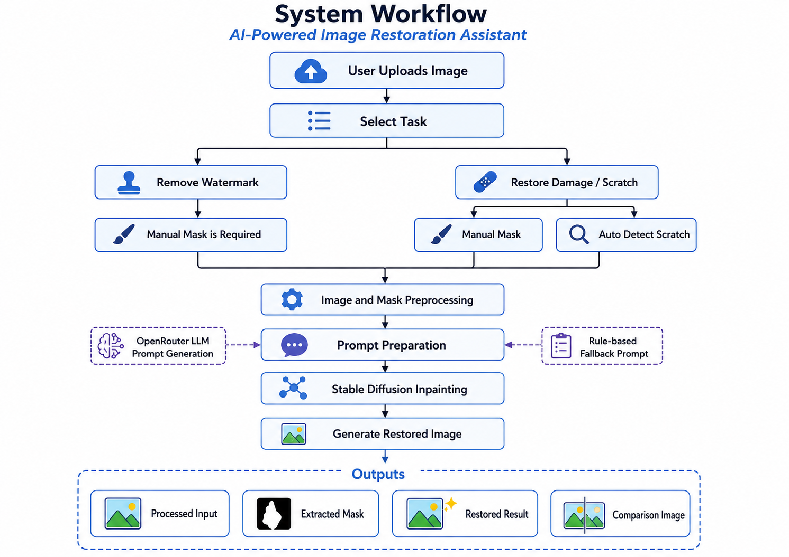

# AI-Powered Image Restoration Assistant

## 1. Project Name

**AI-Powered Image Restoration Assistant**

This project is an image restoration system based on **Stable Diffusion Inpainting**.  
The system allows users to upload an image, select a restoration task, provide a mask manually or automatically, and generate a restored image.

The system currently supports two main tasks:

1. **Remove Watermark**
2. **Restore Damage / Scratch**

---

## 2. Project Overview

Image restoration is an important task in computer vision. It aims to recover damaged, occluded, or unwanted regions in an image while preserving the original visual content.

This project builds a simple interactive application that combines:

- **Gradio Web Interface**
- **Manual Mask Drawing**
- **Automatic Scratch Detection**
- **Stable Diffusion Inpainting**
- **Optional LLM-based Prompt Generation**
- **Rule-based Fallback Prompt Generation**

The user can upload an image and choose the task. For watermark removal, the user manually draws a mask over the watermark region. For scratch or damage restoration, the user can either draw the damaged region manually or use automatic scratch detection.

---

## 3. System Workflow


---

## 4. Main Functions

### 4.1 Remove Watermark

The **Remove Watermark** task is used to remove unwanted text, logos, or watermark regions from an image.

The user needs to manually draw a mask over the watermark area.  
The masked region is then restored using the surrounding image context.

Recommended usage:

```text
Task: Remove Watermark
Mask Mode: Manual Mask
```

---

### 4.2 Restore Damage / Scratch

The **Restore Damage / Scratch** task is used to repair damaged regions, scratches, or visible artifacts in an image.

This task supports two modes:

#### Manual Mask

The user manually draws over the damaged or scratched region.

Recommended for:

- Complex damage
- Large damaged regions
- Damage with unclear color difference from the background

#### Auto Detect Scratch

The system automatically detects bright or white scratch-like damage regions and generates a mask.

Recommended for:

- White scratches
- Bright cracks
- High-contrast damage lines
- Old photo scratch marks

---

## 5. File Structure

A recommended project structure is shown below:

```text
project/
│
├── app.py
├── requirements.txt
├── .env
│
└── src/
    ├── config.py
    ├── image_utils.py
    ├── inpaint_pipeline.py
    └── llm_agent.py

```

---

## 6. Environment Requirements

The project requires Python and several deep learning libraries.

Recommended environment:

```text
Python >= 3.9
CUDA-compatible GPU recommended
```

Main packages:

```text
torch
diffusers
transformers
accelerate
gradio
pillow
numpy
python-dotenv
requests
```

---

## 7. requirements.txt

Create a `requirements.txt` file with the following content:

```txt
torch
torchvision
diffusers
transformers
accelerate
gradio
pillow
numpy
python-dotenv
requests
```

If your environment supports xFormers, you may also install:

```txt
xformers
```

However, xFormers is optional. If it is not available, the program can still run.

---

## 8. Environment Variable Setup

Create a `.env` file in the project root directory.

Example:

```env
OPENROUTER_API_KEY=
OPENROUTER_MODEL=openai/gpt-4o-mini
HF_TOKEN=
```

### 8.1 Hugging Face Token

`HF_TOKEN` is optional for the current model:

```python
MODEL_ID = "runwayml/stable-diffusion-inpainting"
```

If `HF_TOKEN` is not provided, the model can usually still be downloaded anonymously.  
However, Hugging Face may show a warning about unauthenticated requests.

To avoid download limits, create a Hugging Face access token and set:

```env
HF_TOKEN=hf_xxxxxxxxxxxxxxxxxxxxx
```

### 8.2 OpenRouter API Key

`OPENROUTER_API_KEY` is optional.

If it is not provided, the system will use a fixed rule-based prompt template.

If you want to enable LLM prompt generation, set:

```env
OPENROUTER_API_KEY=your_openrouter_api_key
OPENROUTER_MODEL=openai/gpt-4o-mini
```

---

## 9. Local Execution Steps

### Step 1: Clone or Download the Project

```bash
git clone <your-repository-url>
cd <your-project-folder>
```

If you do not use GitHub, directly place all project files in the same folder structure.

---

### Step 2: Create a Virtual Environment

#### Windows

```bash
python -m venv venv
venv\Scripts\activate
```

#### macOS / Linux

```bash
python -m venv venv
source venv/bin/activate
```

---

### Step 3: Install Required Packages

```bash
pip install -r requirements.txt
```

If PyTorch is not installed correctly, install the CUDA version from the official PyTorch website according to your GPU and CUDA version.

Example:

```bash
pip install torch torchvision --index-url https://download.pytorch.org/whl/cu121
```

---

### Step 4: Configure `.env`

Create a `.env` file:

```env
OPENROUTER_API_KEY=
OPENROUTER_MODEL=openai/gpt-4o-mini
HF_TOKEN=
```

If no API key is used, leave the values empty.

---

### Step 5: Run the Application

```bash
python app.py
```

To generate a public Gradio link:

```bash
python app.py --share
```

The terminal will show:

```text
Running on local URL: http://0.0.0.0:7860
Running on public URL: https://xxxx.gradio.live
```

Open the local URL in a browser.

---

## 10. How to Use the App

### Remove Watermark

1. Upload an image.
2. Select **Remove Watermark**.
3. Use the red brush to draw over the watermark.
4. Adjust inference steps and guidance scale if needed.
5. Click **Generate Restoration**.
6. Check:
   - Processed Input
   - Extracted Mask
   - Restored Result
   - Comparison Image

---

### Restore Damage / Scratch with Manual Mask

1. Upload an image.
2. Select **Restore Damage / Scratch**.
3. Select **Manual Mask**.
4. Draw over the damaged or scratched region.
5. Click **Generate Restoration**.

---

### Restore Damage / Scratch with Auto Detect Scratch

1. Upload an image.
2. Select **Restore Damage / Scratch**.
3. Select **Auto Detect Scratch**.
4. Click **Generate Restoration**.
5. Check whether the extracted mask correctly covers the scratches.

This mode works best when the damage is bright, white, and visually different from the background.

---
